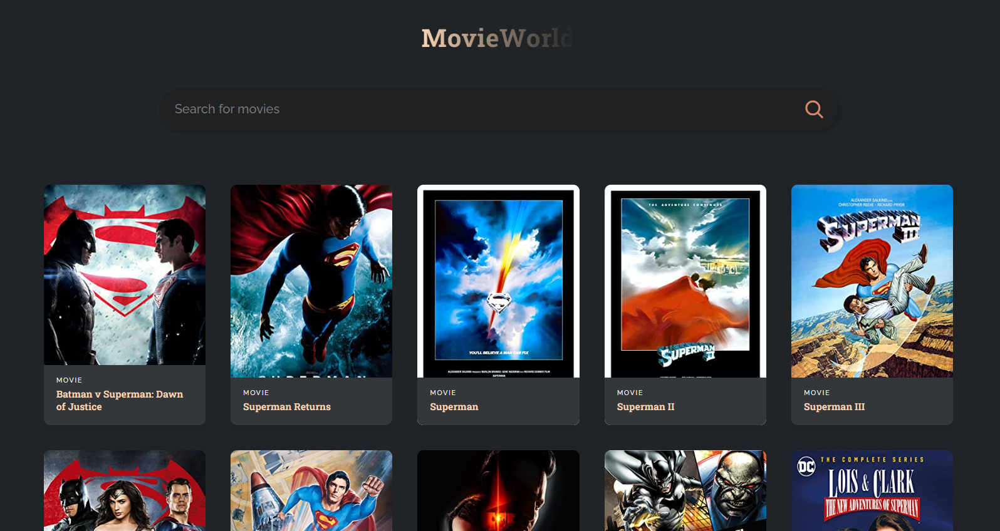
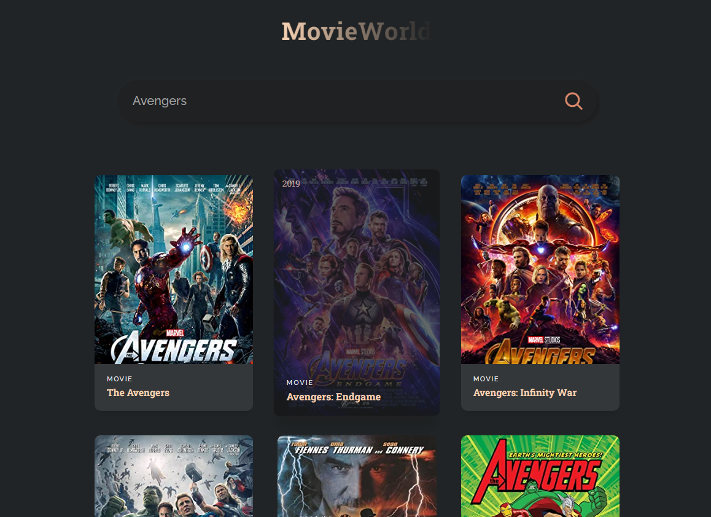

# Simple-Movie-Searching Website with React and OMDB API


## 🔰Introduction

<p>
This is a simple movie searching website with React and OMDB API. You can search for movies and get the information about them.
</p>

## 🔰Features

- Search for movies
- Get the information about the movies
- Get the poster of the movies

## 🔰Technologies

- [React](https://reactjs.org/docs/getting-started.html)
- [OMDB API](https://www.omdbapi.com/apikey.aspx)

## 🔰Installation

<ol>
  <li>Clone the repository</li>

```
git clone https://github.com/kingmalitha/simple-movie-searching-app-MOVIEWORLD.git
```

  <li>Install dependencies</li>

```
cd simple-movie-searching-app-MOVIEWORLD
npm install
```

  <li>Create an API key in OMBD and replace with user API key</li>

```
const API_URL = 'http://www.omdbapi.com?apikey=<YOUR_API_KEY>';

Example: If your API  key is 'efejcsk2'
const API_URL = 'http://www.omdbapi.com?apikey=efejcsk2';
```

  <li>Start the development server</li>

```
npm start
```

  <li>Open http://localhost:3000 to view it in the browser.</li>

</ol>

## 🔰Screenshots





## 🔰Conclusion

<p>
In conclusion, MovieWorld is a simple yet powerful movie search web application that provides users with an easy way to search for movies and view movie information. With its responsive design and user-friendly interface, MovieWorld can be enjoyed on both mobile and desktop devices. 
</p>
